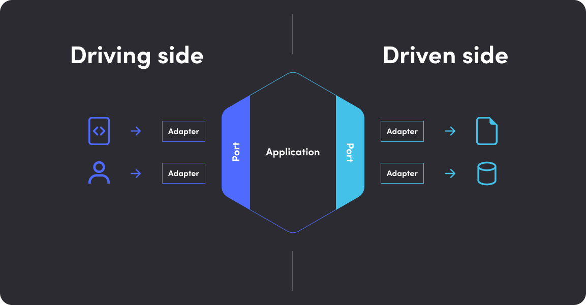

# finance-tracker

# Solution
## Requirement
### 1. Functional Requirements
The application should be able to:
1. Read transaction data from a user-specified CSV file.
2. Filter transactions by the specified period (`YYYYMM`). Only transactions within the given year and month should be processed.
3. Calculate and return:
   - Period should follow the format `YYYYMM`
   - Total income
   - Total expenditure
   - List of transactions, including:
     - Date
     - Amount
     - Content
     - Transactions should be sorted in descending order by date.
4. Output the results in JSON format to stdout.
5. Expect an input CSV file with the following format:
   - The date is string should follow the format `YYYY/MM/DD`.
   - The date of occurrence of deposits and withdrawals is not limited to a specific year and month
   - The amount is a integer that describes amount of deposit/withdrawal.
   - The content is a string that describes the transaction.
   - None of the columns are allowed to be empty.
   - The order of rows is not guaranteed.
```csv
date,amount,content
2023/06/15,-720,transportation
2022/01/05,-1000,eating out
2022/01/06,-10000,debit
2022/02/03,-1500,dining out
2022/01/25,-100000,rent
2023/03/01,200000,salary
```

### 2. Non-Functional Requirements
1. The program should be designed with flexibility in mind to support future enhancements, such as exporting data to a file or supporting different output formats.
3. The application must be efficient and capable of handling large CSV files without consuming excessive memory, ensuring it does not impact system performance.
4. It should provide clear error handling and validation for incorrect inputs, such as:
   - Invalid date format for the period.
   - Missing or unreadable CSV files.
5. The program should have a simple and intuitive command-line interface.

### 3. Additional Considerations
- Handling large CSV files: since there is no file size limit, the program should process the CSV data efficiently using streaming or line-by-line reading instead of loading the entire file into memory.
- Data format assumptions:
  - The CSV file follows a structured format.
  - The amount field uses negative values for expenses and positive values for income.
- Condition assumptions:
  - If no transactions are found, the program will return an error.

## Design Decision
### Architecture Design
To ensure future enhancements, such as changing the output format from JSON to a file, our architecture should be designed in a way that allows seamless modifications without affecting the business logic layer.

To achieve this, we need to separate the business logic layer from the data layer. This separation ensures that the business logic remains isolated and independent of how the data is output, as long as the output meets the required specifications.

#### Using Interfaces in Golang
In Golang, we can achieve this separation by using interfaces, which allow us to abstract the output mechanism while keeping the business logic intact.

#### Hexagonal Architecture (Ports and Adapters)

A structured approach to achieving this separation is Hexagonal Architecture, also known as Ports and Adapters Architecture. This pattern ensures that:
- The business logic layer (core domain) is independent of external systems.
- External systems interact with the core domain through ports (interfaces).
- Implementations (adapters) can be swapped easily without modifying the business logic.
- It becomes easier to test the business logic using test doubles for external dependencies.
#### Clean Architecture

While Hexagonal Architecture focuses on isolating the business logic from external systems, it does not specify how to structure the business logic itself. For a more structured and maintainable approach, we can adopt Clean Architecture, which introduces two key layers within the business logic:

- Entities: Contain enterprise-wide business rules that are independent of any specific application.
- Use Cases: Define application-specific business rules and orchestrate how entities interact.
Clean Architecture follows the same dependency rules as Hexagonal Architecture but further refines how business logic is organized.

#### Conclusion
While both Hexagonal Architecture and Clean Architecture focus on separating business logic from external concerns, Clean Architecture provides a clearer structure by explicitly distinguishing Entities and Use Cases.

By adopting Clean Architecture, we achieve:
- Better Separation of Concerns – Business rules are clearly defined and independent of external systems.
- Easier Maintainability – Future enhancements (e.g., changing JSON output to a file) won’t affect the core business logic.
- Improved Testability – Business logic can be tested independently using test doubles.

Thus, for our project, we will implement **Clean Architecture** to ensure flexibility, scalability, and maintainability while keeping dependencies well structured.

### Worker Pool Pattern
In this case, we do not impose any strict limit on the size of the CSV file. It can be small or extremely large. To optimize performance, we utilize goroutine to read and process the file concurrently. However, if we were to create a separate goroutine for every line in the file, it would cause excessive memory usage, leading to potential memory overhead and, in the worst case, an Out-of-Memory (OOM) error.

Instead of spawning an unlimited number of goroutine, we use a controlled number of workers through the worker pool pattern. This pattern ensures that:
- The number of concurrent goroutine remains within a manageable limit, preventing system overload.
- Processing remains efficient by distributing work among multiple workers without excessive context switching.
- Resources such as CPU and memory are optimally utilized without unnecessary spikes.

#### Data Flow

The function follows these steps:
1. Open the CSV file and initialize a CSV reader.
2. Skip the header row.
3. Create channels:
  a. recordCh: Sends CSV records to workers for processing.
  b. transactionCh: Receives processed transactions.
4. Spawn multiple worker goroutine that listen on recordCh, process records, and send transactions to transactionCh.
5. A separate goroutine reads CSV records and sends them to recordCh.
6. A goroutine waits for all workers to finish, then closes transactionCh.
7. Collect transactions from transactionCh until transactionCh is closed.
8. Sort transactions in descending order and return the result.

### Fake and Spy Instead of Mock
For testing, I chose to use fakes and spies instead of mocks to substitute the real implementation of the interface. Using mocks in this context would be overkill due to the complexity involved.

One major drawback of using mocks is that they can unintentionally expose implementation details in our tests. This creates a tight coupling between tests and the production code, meaning that any changes to the implementation require corresponding updates to the tests. Ideally, tests should focus on verifying the public interface rather than the internal workings of the code.

As Martin Fowler explains:
> A classic test only cares about the final state, not how that state was derived. Mockist tests, on the other hand, are more tightly coupled to the implementation details of a method. As a result, changes in how a method interacts with its dependencies often cause these tests to break.

> Coupling tests to implementation details also makes refactoring more difficult, as even minor changes in the internal structure can lead to failing tests.

For more insights on this topic, see [Coupling Test to Implementations](https://www.martinfowler.com/articles/mocksArentStubs.html#CouplingTestsToImplementations)

## Technology Choices
### Cobra Library
Our goal is to build a robust and user-friendly CLI application, and Cobra provides an ideal framework for this purpose because:
- It simplifies the process of building CLI applications by offering a structured approach similar to widely used tools like git and go, making it easy to create commands, subcommands, and flags with minimal setup.
- It automatically generates help messages and usage instructions, eliminating the need for manual implementation.
- It is widely adopted by major open-source projects such as Kubernetes, Docker, and many others, ensuring strong community support and reliability.
- It provides lifecycle hooks (PreRun, Run, PostRun) that allow efficient execution of setup and cleanup tasks before or after command execution.

## Workflow

1. Understand the Problem: Carefully read and analyze the problem statement. Ensure all key details are noted.
2. Analyze Constraints & Conditions: Identify any specific constraints, assumptions, or conditions that the solution must adhere to.
3. Define Functional/Non-Functional Requirements and Additional Considerations: List the essential features and behaviors the application must support. Look for edge cases, ambiguities, or undefined scenarios that may impact the solution.
4. Design Architecture Application: Evaluate the architecture to accommodate future modifications, such as changing the output format (JSON to file) without affecting business logic.
5. Write Failing Test Case – Begin by writing a test case that captures expected behavior but currently fails (TDD approach).
6. Check if the Test Passes – If the test fails, proceed with implementation. If it passes, move to refactoring.
7. Implement Code – Develop the feature or fix the bug while keeping tests in mind.
8. Run Tests – Execute the test suite to verify changes.
9. Refactor Code – Clean up and optimize the implementation while ensuring the tests still pass.
10. Review & Optimize – Conduct a final review to improve performance, maintainability, and scalability.
11. Complete Feature – Finalize and prepare the feature for deployment or merging.
